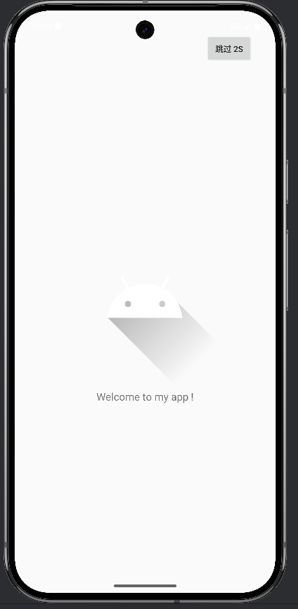
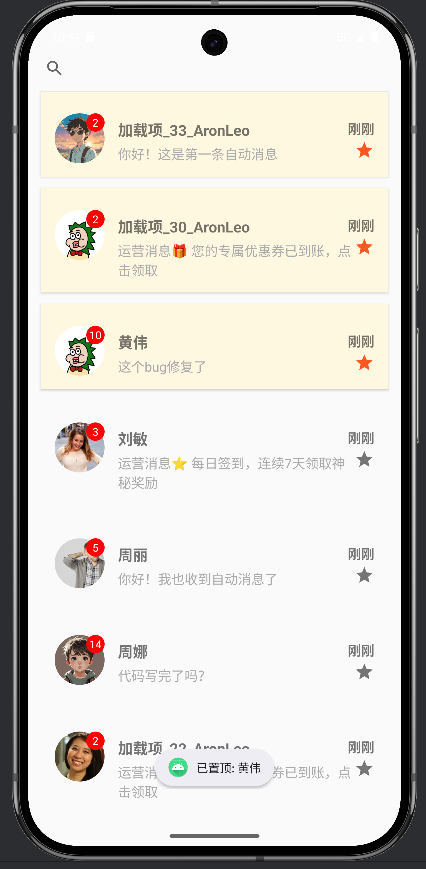
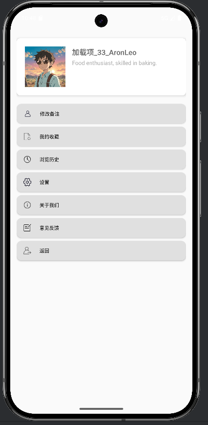

# 字节跳动训练营：抖音增长

*基于Android开发的仿抖音聊天App*

## 📦 实现功能

### 基础要求

1. 基础 UI设计
    - ✔消息列表 UI （User列表 + 系统消息混排）
    - ✔消息 Cell 需包含：头像、昵称、时间文案、消息摘要、未读角标
    - ✔支持以下交互：
        - 下拉刷新
        - 上滑加载更多
        - 空态页面（无数据）

2. 数据要求
    -  ✔本地消息中心模拟发送数据 
        - 支持 3 种消息载体：
            - 纯文本（系统消息）
            - 携带图片（好友发图）
            - 携带按钮的运营类消息（如“领取奖励”）
    - ✔支持分页（模拟分页）
    - ✔首次进入需展示 20 个User列表
    - ✔实现用户根据ispined, newest_info_time的优先级进行排列( 某用户Ispined则优先置顶，多个用户Ispinned按被置顶顺序被置顶)

3. 备注页
    点击任意消息 → 进入备注页：
    - ✔昵称展示
    - ✔输入框可编辑备注(点击修改备注按钮)
    - ✔“保存” Room持久化
    - ✔“退出” 返回时Toast展示修改后的备注信息

4. 本地持久化
    - 消息的未读状态、本地备注、用户交互需要全部落地持久化(Room实现)
    - 冷启动保持与上次操作一(Room实现)

### 进阶要求

1. 本地消息中心模拟
    - ✔通过一个模拟定时器定期插入新消息（如 5 秒一次）
        - 在当前用户列表中随机选择两个，交替发送纯信息（10秒一次），首次发送信息携带图片，其余信息为春文本信息
        - 每30s随机选择一个用户，发送携带按钮的运营类消息
    - ✔消息进入时触发：
        - 列表实时刷新
        - 滚动到顶部
        - 未读数更新(自增1)

2. 消息内容的类型化展示
-   ✔支持 3 种消息体裁：
    - 纯文本（系统消息）
    - 携带图片（好友发图）
    - 携带按钮的运营类消息

3. 消息时间文案规则
- ✔实现以下规则：
    - 1 分钟内：刚刚
    - 1 小时内：xx 分钟前
    - 今天：xx:xx
    - 昨天：昨天 xx:xx
    - 7 天内：x 天前
    - 其他：MM-dd

4. 搜索消息
   - ✔消息列表顶部支持搜索框：
        - 支持搜索昵称 + 消息内容
        - 高亮展示命中关键词
        - 搜索结果与正常列表复用 UI(包括启用pinned)

5. 自定义转场动画
    - ✔从列表 → 备注页，支持：
        - 渐变 + 卡片跟手放大
        - dismiss 时跟手下滑

6. SQLite Migration
    - ✔实现一次 Schema 升级
        - 给消息表增加 “isPinned” 字段
        - 兼容老版本数据
        - 自动迁移逻辑清晰
7. 弱网/无网体验
    - 实现：
        - 首刷空白态
        - 加载过程的占位 UI skeleton

#### 自由探索

1. 消息召回 & 增长策略模拟
    - 统计每日未读消息数
2. 聊天界面支持文本框输入，输入内容Room本地持久化

## 💡 使用示例

## 📷 模拟器

Pixel 9 Pro XL

## ⏩ 最近更新

- **2025.01.13**：🎉 2025.12.08开源发布
